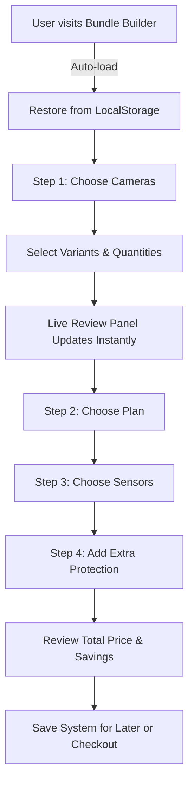
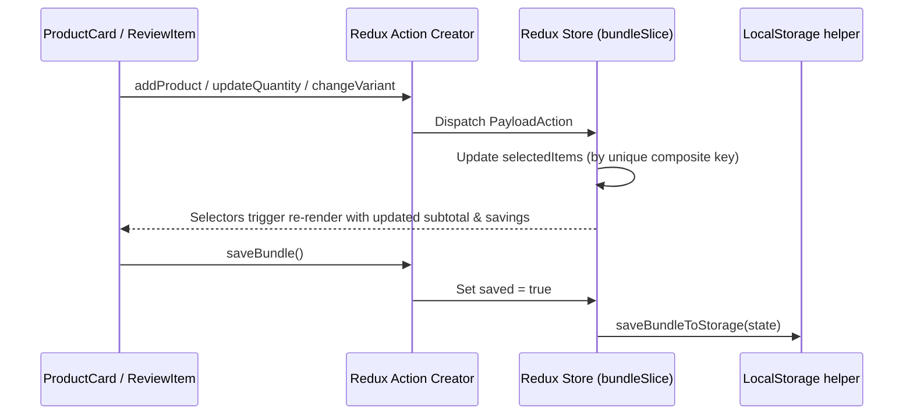

# Application Workflow & Architecture

This document explains the user journey, component communication, and Redux Toolkit data flow for the Bundle Builder application.

---

## 1. User Journey

1. **Initialization**: On application startup, `useLocalStorageRestore` dispatches `restoreBundle()`, checking LocalStorage key `bundle_configuration`. If found, previously selected bundle items are automatically restored into Redux state.
2. **Step Navigation**: Users navigate through 4 collapsible accordion steps (`BundleSteps` -> `StepAccordion`). Clicking a step header expands its product grid while collapsing others.
3. **Product Configuration**: Each `ProductCard` allows users to select color/billing variants (`ProductVariantSelector`) and increment/decrement quantities (`QuantityStepper`).
4. **Real-Time Live Review**: Any change dispatches a Redux action (`addProduct` / `updateQuantity` / `changeVariant`). The `ReviewPanel` automatically recalculates subtotals, bundle discounts, shipping eligibility, and monthly financing.
5. **Persistence & Checkout**: Users can click "Save my system for later" to persist their configuration to LocalStorage, or "Proceed to Secure Checkout".

---

## 2. Redux Toolkit Architecture & Data Flow

### Key Technical Decision: Composite Key Isolation
Each selected product line item uses a composite key:
`key = ${productId}_${variantId || 'default'}`
This prevents variants of the same product (e.g. Black Camera vs White Camera) from overwriting each other when quantities change.
